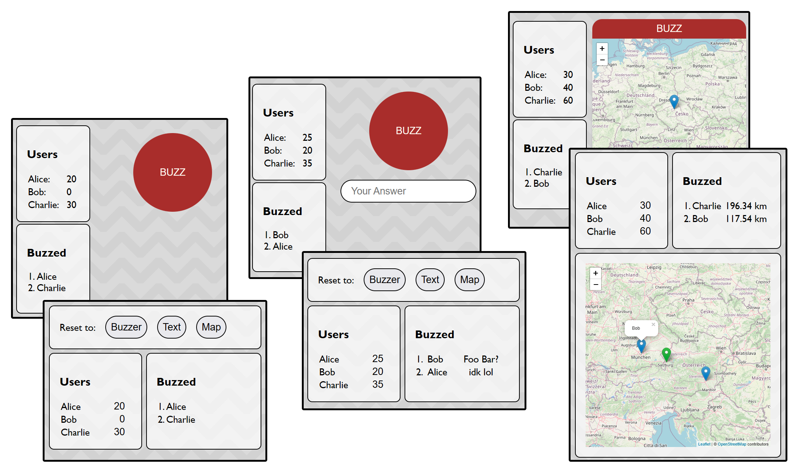

# JPDBuzz



JPDBuzz is a simple web application I wrote for playing game-show-like games with friends. It provides a buzzer system that can be used by players to buzz in and submit their answers.

The program is built using HTML, CSS, JavaScript, and Node.js. [Mousetrap](https://github.com/ccampbell/mousetrap/) is used to detect keypresses for buzzing. [Leaflet](https://github.com/Leaflet/Leaflet) is used for selecting locations on a map.

## Getting Started

### Prerequisites

- Node.js
- NPM

### Installation

1. Clone the repository (or download as zip)

```sh
git clone https://github.com/mrtnstkl/jpdbuzz.git
```

2. Install NPM packages

```sh
npm install
```

### Configuration

The application uses 4 ports. You can change them by editing the `config.js` file.

|                  | default port  | description |
|------------------|------|----------------------|
| `hostHttpPort`   | 8086 | serves frontend to the game host |
| `hostWsPort`     | 8087 | websocket communication with the game host |
| `clientHttpPort` | 8088 | serves frontend to the players |
| `clientWsPort`   | 8089 | websocket communication with the players |

You will need to forward the client ports. If you want the host interface to be accessible from the outside, you'll also have to forward the host ports.

## Usage

Start the program using `npm start`. Further info is printed to the console.

### Host Interface

The host interface is used to control the game and view the players' submissions. The host can set the buzzer mode, reset the players' buzzers, view the players' submissions, and give points.

Note that the host interface can currently only be open in one tab. 

### Player Interface

The player interface is used by the players to buzz in and submit their answers.

You can hit the spacebar or enter-key to buzz.

### Buzzer Modes

**Buzzer:** The players simply buzz in without any additional data. The order in which the players buzzed is visible to the host and other players.

**Text:** The players can enter text that will be submitted along with their buzz. The host can see those answers, other players cannot.

**Map:** The players can pick a location on a map that will be submitted along with their buzz. The host interface displays the buzzed locations as pins on a map. The host can also interact with that map to calculate the distance of the submissions to a given location.

